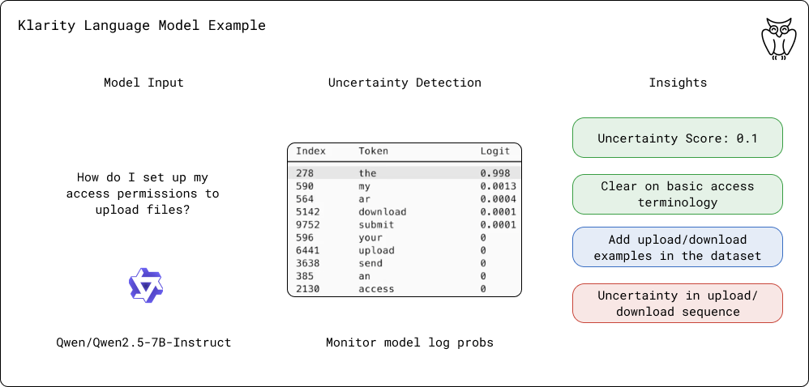

# Klarity

<div align="center">
  
  <br>
  <br>
  

  # Klarity 

  _Understanding uncertainty in generative model predictions_
  <br>
  <br>
  <a href="https://discord.gg/wCnTRzBE">
    
  </a>
</div>

## 🎯 Overview

Klarity is a tool for analyzing uncertainty in generative model outputs. It combines both raw probability analysis and semantic understanding to provide deep insights into model behavior during text generation. The library offers:

- **Dual Entropy Analysis**: Combines raw probability entropy with semantic similarity-based entropy
- **Semantic Clustering**: Groups similar predictions to understand model decision-making
- **Structured Output**: Returns detailed JSON analysis of generation patterns
- **AI-powered Analysis**: Uses a separate model to analyze generation patterns and provide human-readable insights

<div align="center">
  <br>
  
  <br>
</div>

## 🚀 Quick Start

Install directly from GitHub:
```bash
pip install git+https://github.com/klara-research/klarity.git
```

Basic usage example:
```python
from transformers import AutoModelForCausalLM, AutoTokenizer, LogitsProcessorList
from klarity import UncertaintyEstimator
from klarity.core.analyzer import EntropyAnalyzer

# Initialize your model
model_name = "Qwen/Qwen2.5-7B"
model = AutoModelForCausalLM.from_pretrained(model_name)
tokenizer = AutoTokenizer.from_pretrained(model_name)

# Initialize your insight model
insight_model_name = "Qwen/Qwen2.5-7B-Instruct"  # You can choose any model
insight_model = AutoModelForCausalLM.from_pretrained(insight_model_name)
insight_tokenizer = AutoTokenizer.from_pretrained(insight_model_name)

# Create estimator
estimator = UncertaintyEstimator(
    top_k=100,
    analyzer=EntropyAnalyzer(
        min_token_prob=0.01,
        insight_model=insight_model,
        insight_tokenizer=insight_tokenizer
    )
)
uncertainty_processor = estimator.get_logits_processor()

# Set up generation
prompt = "Your prompt"
inputs = tokenizer(prompt, return_tensors="pt")

# Generate with uncertainty analysis
generation_output = model.generate(
    **inputs,
    max_new_tokens=20,
    temperature=0.7,
    top_p=0.9,
    logits_processor=LogitsProcessorList([uncertainty_processor]),
    return_dict_in_generate=True,
    output_scores=True,
)

# Analyze the generation
result = estimator.analyze_generation(
    generation_output,
    tokenizer,
    uncertainty_processor
)

generated_text = tokenizer.decode(generation_output.sequences[0], skip_special_tokens=True)

# Inspect results
print(f"\nPrompt: {prompt}")
print(f"Generated text: {generated_text}")

print("\nDetailed Token Analysis:")
for idx, metrics in enumerate(result.token_metrics):
    print(f"\nStep {idx}:")
    print(f"Raw entropy: {metrics.raw_entropy:.4f}")
    print(f"Semantic entropy: {metrics.semantic_entropy:.4f}")
    print("Top 3 predictions:")
    for i, pred in enumerate(metrics.token_predictions[:3], 1):
        print(f"  {i}. {pred.token} (prob: {pred.probability:.4f})")

# Show comprehensive insight
print("\nComprehensive Analysis:")
print(result.overall_insight)
```

## 📊 Analysis Output

Klarity provides a structured JSON analysis for each generation, the insight quality depends on the model that you choose.

```python
{
    "uncertainty_points": [
        {
            "step": int,          # Generation step number
            "entropy": float,     # Entropy value at this step
            "options": string[],  # Top competing options
            "type": string       # Type of uncertainty
        }
    ],
    "high_confidence": [
        {
            "step": int,          # Generation step number
            "probability": float, # Token probability
            "token": string,     # Chosen token
            "context": string    # Contextual information
        }
    ],
    "risk_areas": [
        {
            "type": string,      # Type of risk identified
            "steps": int[],      # Affected steps
            "reasoning": string  # Explanation of the risk
        }
    ],
    "suggestions": [
        {
            "issue": string,     # Identified issue
            "improvement": string # Suggested improvement
        }
    ]
}
```

## 🤖 Supported Frameworks & Models

### Model Frameworks
Currently supported:
- ✅ Hugging Face Transformers

Planned support:
- ⏳ PyTorch

### Tested Target Models
| Model | Type | Status | Notes |
|-------|------|--------|--------|
| Qwen2.5-0.5B | Base | ✅ Tested | Full Support |
| Qwen2.5-0.5B-Instruct | Instruct | ✅ Tested | Full Support |
| Qwen2.5-7B | Base | ✅ Tested | Full Support |
| Qwen2.5-7B-Instruct | Instruct | ✅ Tested | Full Support |

### Analysis Models
| Model | Type | Status | JSON Reliability | Notes |
|-------|------|--------|-----------------|--------|
| Qwen2.5-0.5B-Instruct | Instruct | ✅ Tested | ⚡ Low | Consistently output unstructured analysis instead of JSON. Best used with structured prompting and validation. |
| Qwen2.5-7B-Instruct | Instruct | ✅ Tested | ✅ High | Consistently outputs well-formed JSON analysis. Recommended for production use. |

### JSON Output Reliability Guide:
- ✅ High: Consistently outputs valid JSON (>80% of responses)
- ⚠️ Moderate: Usually outputs valid JSON (50-80% of responses)
- ⚡ Low: Inconsistent JSON output (<50% of responses)

## 🔍 Advanced Features

### Custom Analysis Configuration
You can customize the analysis parameters:
```python
analyzer = EntropyAnalyzer(
    min_token_prob=0.01,  # Minimum probability threshold
    semantic_similarity_threshold=0.8  # Threshold for semantic grouping
)
```

## 🤝 Contributing

Contributions are welcome! Areas we're looking to improve:

- Additional framework support
- More tested models
- Enhanced semantic analysis
- Additional analysis metrics
- Documentation and examples

Please see our [Contributing Guide](CONTRIBUTING.md) for details.

## 📝 License

Apache 2.0 License. See [LICENSE](LICENSE) for more information.

## 📫 Community & Support

- [Website](https://klaralabs.com)
- [Discord Community](https://discord.gg/wCnTRzBE) for discussions & chatting
- [GitHub Issues](https://github.com/klara-research/klarity/issues) for bugs and features

