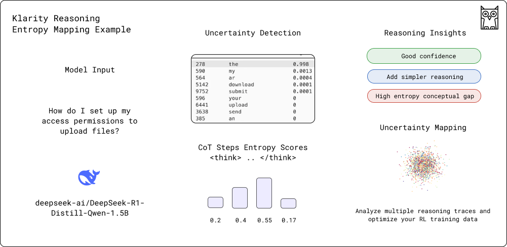

<div align="center">

  

  # Klarity 

**Toolkit for LLM behavior analysis & uncertainty mitigation**
    <br>
    <br>
    🐳 **Now with reasoning model support to analyse CoTs entropy and improve RL datasets**
    <br>
    <br>
  <a href="https://discord.gg/wCnTRzBE">
    
  </a>
</div>

## 🎯 Overview

Klarity is a toolkit for inspecting and debugging AI decision-making processes. By combining uncertainty analysis with reasoning insights, it helps you understand how models think and fix issues before they reach production.

- **Dual Entropy Analysis**: Measure model confidence through raw entropy and semantic similarity metrics
- **Reasoning Analysis**: Extract and evaluate step-by-step thinking patterns in model outputs
- **Semantic Clustering**: Group similar predictions to reveal decision-making pathways
- **Structured Insights**: Get detailed JSON analysis of both uncertainty patterns and reasoning steps
- **AI-powered Report**: Leverage capable models to interpret generation patterns and provide human-readable insights

<div align="center">
  <br>
  <p><i>Reasoning Analysis Example - Understanding model's step-by-step thinking process</i></p>
  
  <br>
  <br>
  <p><i>Entropy Analysis Example - Analyzing token-level uncertainty patterns</i></p>
  
  <br>
</div>

## 🚀 Quick Start Hugging Face

Install directly from GitHub:
```bash
pip install git+https://github.com/klara-research/klarity.git
```

### 📝 Reasoning LLM Usage Example
For insights and uncertainty analytics into model reasoning patterns, you can use the ReasoningAnalyzer:

```python
from transformers import AutoModelForCausalLM, AutoTokenizer, LogitsProcessorList
from klarity import UncertaintyEstimator
from klarity.core.analyzer import ReasoningAnalyzer
import torch

# Initialize model with GPU support
device = "cuda" if torch.cuda.is_available() else "cpu"

model_name = "deepseek-ai/DeepSeek-R1-Distill-Qwen-7B"
model = AutoModelForCausalLM.from_pretrained(model_name)
model = model.to(device)  # Move model to GPU
tokenizer = AutoTokenizer.from_pretrained(model_name)

# Create estimator with reasoning analyzer and togetherai hosted model
estimator = UncertaintyEstimator(
    top_k=100,
    analyzer=ReasoningAnalyzer(
        min_token_prob=0.01,
        insight_model="together:meta-llama/Llama-3.3-70B-Instruct-Turbo",
        insight_api_key="your_api_key",
        reasoning_start_token="<think>", 
        reasoning_end_token="</think>"
    )
)
uncertainty_processor = estimator.get_logits_processor()

# Set up generation
prompt = "Your prompt <think>\n"
inputs = tokenizer(prompt, return_tensors="pt").to(device)

# Generate with uncertainty analysis
generation_output = model.generate(
    **inputs,
    max_new_tokens=200,  # Increased for reasoning steps
    temperature=0.6,
    logits_processor=LogitsProcessorList([uncertainty_processor]),
    return_dict_in_generate=True,
    output_scores=True,
)

# Analyze the generation
result = estimator.analyze_generation(
    generation_output,
    tokenizer,
    uncertainty_processor,
    prompt  # Include prompt for better reasoning analysis
)

# Get generated text
generated_text = tokenizer.decode(generation_output.sequences[0], skip_special_tokens=True)
print(f"\nPrompt: {prompt}")
print(f"Generated text: {generated_text}")

# Show reasoning analysis
print("\nReasoning Analysis:")
if result.overall_insight and "reasoning_analysis" in result.overall_insight:
    analysis = result.overall_insight["reasoning_analysis"]
    
    # Print each reasoning step
    for idx, step in enumerate(analysis["steps"], 1):
        print(f"\nStep {idx}:")  # Use simple counter instead of accessing step_number
        print(f"Content: {step['step_info']['content']}")
        
        # Print step analysis
        if 'analysis' in step and 'training_insights' in step['analysis']:
            step_analysis = step['analysis']['training_insights']
            print("\nQuality Metrics:")
            for metric, score in step_analysis['step_quality'].items():
                print(f"  {metric}: {score}")
            
            print("\nImprovement Targets:")
            for target in step_analysis['improvement_targets']:
                print(f"  Aspect: {target['aspect']}")
                print(f"  Importance: {target['importance']}")
                print(f"  Issue: {target['current_issue']}")
                print(f"  Suggestion: {target['training_suggestion']}")
```

### 📝 Standard LLM Usage Example
To prevent most of common uncertainty scenarios and route to better models you can use our EntropyAnalyzer

```python
from transformers import AutoModelForCausalLM, AutoTokenizer, LogitsProcessorList
from klarity import UncertaintyEstimator
from klarity.core.analyzer import EntropyAnalyzer

# Initialize your model
model_name = "Qwen/Qwen2.5-7B-Instruct"
model = AutoModelForCausalLM.from_pretrained(model_name)
tokenizer = AutoTokenizer.from_pretrained(model_name)

# Create estimator
estimator = UncertaintyEstimator(
    top_k=100,
    analyzer=EntropyAnalyzer(
        min_token_prob=0.01,
        insight_model=model,
        insight_tokenizer=tokenizer
    )
)

uncertainty_processor = estimator.get_logits_processor()

# Set up generation
prompt = "Your prompt"
inputs = tokenizer(prompt, return_tensors="pt")

# Generate with uncertainty analysis
generation_output = model.generate(
    **inputs,
    max_new_tokens=20,
    temperature=0.7,
    top_p=0.9,
    logits_processor=LogitsProcessorList([uncertainty_processor]),
    return_dict_in_generate=True,
    output_scores=True,
)

# Analyze the generation
result = estimator.analyze_generation(
    generation_output,
    tokenizer,
    uncertainty_processor
)

generated_text = tokenizer.decode(generation_output.sequences[0], skip_special_tokens=True)

# Inspect results
print(f"\nPrompt: {prompt}")
print(f"Generated text: {generated_text}")

print("\nDetailed Token Analysis:")
for idx, metrics in enumerate(result.token_metrics):
    print(f"\nStep {idx}:")
    print(f"Raw entropy: {metrics.raw_entropy:.4f}")
    print(f"Semantic entropy: {metrics.semantic_entropy:.4f}")
    print("Top 3 predictions:")
    for i, pred in enumerate(metrics.token_predictions[:3], 1):
        print(f"  {i}. {pred.token} (prob: {pred.probability:.4f})")

# Show comprehensive insight
print("\nComprehensive Analysis:")
print(result.overall_insight)
```

## 📊 Analysis Output
Klarity provides two types of analysis output:

### Reasoning Analysis
You'll get detailed insights into the model's reasoning process:

```json
{
    "reasoning_analysis": {
        "steps": [
            {
                "step_number": 1,
                "step_info": {
                    "content": "Step reasoning content",
                    "type": "analysis"
                },
                "analysis": {
                    "training_insights": {
                        "step_quality": {
                            "coherence": "0.8",
                            "relevance": "0.9",
                            "confidence": "0.7"
                        },
                        "improvement_targets": [
                            {
                                "aspect": "conciseness",
                                "importance": "0.8",
                                "current_issue": "verbose response",
                                "training_suggestion": "reduce explanation steps"
                            }
                        ]
                    }
                }
            }
        ]
    }
}
```

### Entropy Analysis
For standard language models you will get a general uncertainty report:

```json
{
    "scores": {
        "overall_uncertainty": "<0-1>",  
        "confidence_score": "<0-1>",     
        "hallucination_risk": "<0-1>"    
    },
    "uncertainty_analysis": {
        "high_uncertainty_parts": [
            {
                "text": "",
                "why": ""
            }
        ],
        "main_issues": [
            {
                "issue": "",
                "evidence": ""
            }
        ],
        "key_suggestions": [
            {
                "what": "",
                "how": ""
            }
        ]
    }
}
```

## 🤖 Supported Frameworks & Models

### Model Frameworks
Currently supported:
- ✅ Hugging Face Transformers
-> Full uncertainty analysis with raw and semantic entropy metrics

- ✅ Together AI
-> Uncertainty analysis with raw log prob. metrics

Planned support:
- ⏳ PyTorch

### Analysis Model (for the insights) Frameworks
Currently supported:
- ✅ Hugging Face Transformers
- ✅ Together AI API

Planned support:
- ⏳ PyTorch

### Tested Target Models
| Model | Type | Status | Notes |
|-------|------|--------|--------|
| Qwen2.5-0.5B | Base | ✅ Tested | Full Support |
| Qwen2.5-0.5B-Instruct | Instruct | ✅ Tested | Full Support |
| Qwen2.5-7B | Base | ✅ Tested | Full Support |
| Qwen2.5-7B-Instruct | Instruct | ✅ Tested | Full Support |
| Llama-3.2-3B-Instruct | Instruct | ✅ Tested | Full Support |
| DeepSeek-R1-Distill-Qwen-1.5B | Reasoning | ✅ Tested | Together API Insights |
| DeepSeek-R1-Distill-Qwen-7B | Reasoning | ✅ Tested | Together API Insights |

### Analysis Models
| Model | Type | Status | JSON Reliability | Notes |
|-------|------|--------|-----------------|--------|
| Qwen2.5-0.5B-Instruct | Instruct | ✅ Tested | ⚡ Low | Consistently output unstructured analysis instead of JSON. Best used with structured prompting and validation. |
| Qwen2.5-7B-Instruct | Instruct | ✅ Tested | ⚠️ Moderate | Sometimes outputs well-formed JSON analysis. |
| Llama-3.3-70B-Instruct-Turbo | Instruct | ✅ Tested | ✅ High | Reliably outputs well-formed JSON analysis. Recommended for production use. |

### JSON Output Reliability Guide:
- ✅ High: Consistently outputs valid JSON (>80% of responses)
- ⚠️ Moderate: Usually outputs valid JSON (50-80% of responses)
- ⚡ Low: Inconsistent JSON output (<50% of responses)

## 🔍 Advanced Features

### Custom Analysis Configuration
You can customize the analysis parameters:
```python
analyzer = EntropyAnalyzer(
    min_token_prob=0.01,  # Minimum probability threshold
    semantic_similarity_threshold=0.8  # Threshold for semantic grouping
)
```

## 🤝 Contributing

Contributions are welcome! Areas we're looking to improve:

- Additional framework support
- More tested models
- Enhanced semantic analysis
- Additional analysis metrics
- Documentation and examples

Please see our [Contributing Guide](CONTRIBUTING.md) for details.

## 📝 License

Apache 2.0 License. See [LICENSE](LICENSE) for more information.

## 📫 Community & Support

- [Website](https://klaralabs.com)
- [Discord Community](https://discord.gg/wCnTRzBE) for discussions & chatting
- [GitHub Issues](https://github.com/klara-research/klarity/issues) for bugs and features


<div align="center">

  

</div>